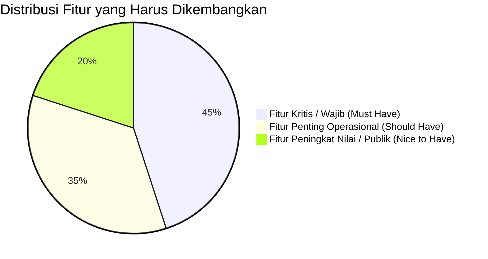

# 📋 Daftar Detail Fitur yang Belum Ada & Harus Ada (KORMI Backend)

Dokumen ini memetakan secara presisi semua fitur yang **belum ada**, tingkat urgensinya, alasan keharusannya (*business justification*), arsitektur teknis yang direkomendasikan, serta checklist pengerjaannya.

---

## 🧭 Rekap Prioritas Kebutuhan

---

## 🔴 1. LEVEL 1: KRITIS & WAJIB ADA (*Must Have*)

Fitur pada level ini wajib ada karena ketiadaannya menyebabkan risiko keamanan, ketidakmampuan operasional dasar, atau hilangnya integritas data.

---

### 1.1. Role-Based Access Control (RBAC) & Middleware Otorisasi
* **Status Saat Ini**: Tabel `kormi_peran` sudah ada, tapi route admin hanya dicek dengan middleware `auth` biasa. Semua pengguna yang login (Super Admin, Editor Berita, Staf Inorga, dll.) memiliki hak akses penuh ke seluruh menu admin.
* **Mengapa Harus Ada**: Mencegah staf operasional/editor merusak pengaturan web, mengubah data akun pengguna lain, atau menghapus data keanggotaan penting.
* **Rincian yang Harus Dibuat**:
  - [ ] Middleware khusus: `RoleMiddleware` atau `CekPeran:superadmin,editor,staf`
  - [ ] Role hierarchy:
    1. **Super Admin**: Akses penuh (Pengaturan, Pengguna, Database, Log).
    2. **Admin Media/Editor**: Berita, Galeri, Unduhan.
    3. **Admin Organisasi & Inorga**: Inorga, Duta, Pengurus, KORDIK, Proker.
    4. **Admin Pertandingan/Event**: Event, Cabang, Jadwal, Klasemen Medali.
    5. **Admin SDI & Sapras**: Pelatihan SDI, Verifikasi Peserta, Sarana Prasarana.
  - [ ] Directive Blade/Livewire `@can` atau helper `$user->punyaPeran('superadmin')` untuk membatasi tombol aksi (Edit/Hapus).

---

### 1.2. Halaman UI Viewer Log Aktivitas (Audit Trail)
* **Status Saat Ini**: [AktivitasObserver.php](file:///Volumes/Data/Aplikasi%20-%20WEB/2026/kormi-backend-laravel/app/Observers/AktivitasObserver.php) sudah aktif mencatat setiap aksi `tambah`, `ubah`, `hapus` ke tabel `kormi_log_aktivitas`, namun belum ada halaman Admin CMS untuk melihat dan memantau riwayat audit ini.
* **Mengapa Harus Ada**: Admin tidak bisa mengaudit siapa yang mengubah skor medali, siapa yang menghapus data berita/pengurus, atau melacak IP dan waktu perubahan jika terjadi anomali data.
* **Rincian yang Harus Dibuat**:
  - [ ] Buat Livewire Component: `App\Livewire\Admin\Log\LogKelola.php` & view pendukung.
  - [ ] Fitur Filter: Berdasarkan jenis aksi (tambah/ubah/hapus), nama tabel (berita, klasemen, inorga, dll), dan pengguna.
  - [ ] Modal Detail: Menampilkan perbandingan JSON `data_lama` vs `data_baru` dalam format diff/tabel yang mudah dibaca.
  - [ ] Fitur Pembersihan/Purging log lama (> 6 bulan).

---

### 1.3. Keamanan Endpoint Login (Rate Limiting / Throttle)
* **Status Saat Ini**: Endpoint login livewire dan POST login belum memiliki pembatasan percobaan gagal (*throttling*).
* **Mengapa Harus Ada**: Mencegah serangan *Brute Force* dan *Credential Stuffing* terhadap akun admin CMS.
* **Rincian yang Harus Dibuat**:
  - [ ] Tambahkan `RateLimiter::hit()` dan `RateLimiter::tooManyAttempts()` pada method `login()` di [Masuk.php](file:///Volumes/Data/Aplikasi%20-%20WEB/2026/kormi-backend-laravel/app/Livewire/Admin/Auth/Masuk.php).
  - [ ] Limit maksimal 5 kali percobaan gagal per 60 detik per IP/email.
  - [ ] Lockout countdown timer pada tampilan form login.

---

### 1.4. Pembersihan Route & Tombol Bypass Login
* **Status Saat Ini**: Terdapat tombol "Bypass Admin Login" dan method `directBypassLogin()` di [Masuk.php](file:///Volumes/Data/Aplikasi%20-%20WEB/2026/kormi-backend-laravel/app/Livewire/Admin/Auth/Masuk.php) serta rute `/private-infomugi`.
* **Mengapa Harus Ada**: Tombol bypass tidak boleh tampil saat aplikasi live/production.
* **Rincian yang Harus Dibuat**:
  - [ ] Bungkus tombol bypass login di view `masuk.blade.php` dengan pengecekan `@if(app()->environment('local', 'development'))`.
  - [ ] Validasi guard di method `directBypassLogin()` agar melempar exception 403 jika dijalankan di environment `production`.

---

## 🟡 2. LEVEL 2: PENTING UNTUK OPERASIONAL & LAYANAN (*Should Have*)

Fitur yang sangat dibutuhkan untuk kelancaran administrasi KORMI Kabupaten Bandung dan interaksi dengan masyarakat.

---

### 2.1. Halaman Publik Kontak, Peta Sekretariat & Form Pengaduan/Pesan
* **Status Saat Ini**: Belum ada halaman Kontak Kami di portal publik. Data kontak hanya tersimpan di pengaturan.
* **Mengapa Harus Ada**: Masyarakat, perwakilan Inorga kecamatan, atau stakeholder Dispora memerlukan kanal resmi untuk menghubungi sekretariat KORMI.
* **Rincian yang Harus Dibuat**:
  - [ ] Buat Livewire Component: `App\Livewire\Publik\Kontak\KontakIndex.php`.
  - [ ] Embed Google Maps lokasi Kantor KORMI Kabupaten Bandung (Stadion Si Jalak Harupat / Soreang).
  - [ ] Formulir Kirim Pesan / Pengaduan Publik (Nama, Email, No. HP, Kategori Pesan, Isi Pesan).
  - [ ] Tabel Database `kormi_pesan_kontak` & Halaman Admin untuk membaca / membalas pesan masuk.

---

### 2.2. Formulir Registrasi & Verifikasi Inorga Online
* **Status Saat Ini**: Inorga hanya bisa diinput manual satu per satu oleh Admin dari CMS.
* **Mengapa Harus Ada**: Setiap tahun terdapat pendaftaran Inorga baru atau pembaharuan SK kepengurusan dari tingkat kecamatan/kabupaten.
* **Rincian yang Harus Dibuat**:
  - [ ] Form Pendaftaran Publik: `App\Livewire\Publik\Inorga\InorgaDaftar.php`.
  - [ ] Upload Berkas Persyaratan: SK Kemenkumham, AD/ART, Susunan Pengurus, Surat Rekomendasi (PDF/Gambar ke MinIO).
  - [ ] Status Pengajuan Inorga: `menunggu_verifikasi`, `disetujui`, `ditolak` (disertai catatan revisi dari admin).
  - [ ] Tab Review Pengajuan di `InorgaKelola.php`.

---

### 2.3. Pendaftaran Peserta Pelatihan SDI Online
* **Status Saat Ini**: Tabel `kormi_sdi_peserta` sudah siap di database, tetapi pendaftaran peserta belum memiliki form publik (hanya bisa diisi manual oleh admin).
* **Mengapa Harus Ada**: Menghilangkan proses pendaftaran manual via WhatsApp/Google Form dan mendata peserta pelatihan juri/pelatih secara terpusat.
* **Rincian yang Harus Dibuat**:
  - [ ] Form Pendaftaran di halaman publik SDI ([Sdi.php](file:///Volumes/Data/Aplikasi%20-%20WEB/2026/kormi-backend-laravel/app/Livewire/Publik/Informasi/Sdi.php)): NIK, Nama, No HP, Asal Inorga/Kecamatan, Upload Pas Foto.
  - [ ] Validasi Kuota Peserta: Otomatis menutup pendaftaran jika `jumlah_pendaftar` >= `kuota_peserta`.
  - [ ] Generator Nomor Peserta / E-Tiket Pendaftaran.

---

### 2.4. Fitur Export Data (Excel & PDF)
* **Status Saat Ini**: Belum ada fitur download laporan tabular/rekapitulasi dari halaman admin.
* **Mengapa Harus Ada**: Pengurus KORMI sering membutuhkan rekap data cetak/file Excel untuk laporan berkala ke Dispora Kabupaten Bandung & KORMI Jawa Barat.
* **Rincian yang Harus Dibuat**:
  - [ ] Export Klasemen Medali Event (PDF format resmi & Excel).
  - [ ] Export Rekap Induk Organisasi (Inorga) aktif beserta pengurus & jumlah klub.
  - [ ] Export Data Sarana & Prasarana Olahraga (Sapras) per 31 Kecamatan.
  - [ ] Export Rekapitulasi Duta Olahraga & Penerima APMO.
  - [ ] Integrasikan library `barryvdh/laravel-dompdf` atau `maatwebsite/excel`.

---

### 2.5. Pencarian Global & Detail Induk Organisasi (Inorga Single Page)
* **Status Saat Ini**: Pencarian hanya ada per modul, dan halaman Inorga hanya menampilkan kartu ringkas modal.
* **Mengapa Harus Ada**: Pengunjung publik butuh mencari berita/event/inorga dalam satu kolom search di navbar, serta halaman profil khusus untuk masing-masing Inorga.
* **Rincian yang Harus Dibuat**:
  - [ ] Halaman `App\Livewire\Publik\Inorga\InorgaDetail.php` (`/inorga/{slug}`) menampilkan profil lengkap, sejarah cabang, daftar klub anggota, susunan pengurus, dan galeri kegiatan Inorga.
  - [ ] Global Search Component di Navbar yang mencari lintas tabel (Berita, Inorga, Event, Unduhan).

---

## 🟢 3. LEVEL 3: INTEGRASI & PENINGKATAN KINERJA (*Nice to Have*)

Fitur modern untuk meningkatkan daya saing, interoperabilitas data, dan otomatisasi backend.

---

### 3.1. REST API Layer (Headless / Mobile Ready)
* **Status Saat Ini**: Belum ada `routes/api.php` dan Controller API.
* **Kebutuhan Masa Depan**:
  - [ ] Endpoint `GET /api/v1/berita`: Untuk feed berita aplikasi mobile atau portal Pemda Kab. Bandung.
  - [ ] Endpoint `GET /api/v1/klasemen/{eventId}`: Untuk live score widget videotron saat FORKAB berlangsung.
  - [ ] Endpoint `GET /api/v1/inorga`: Direktori terbuka untuk publikasi.
  - [ ] Laravel Sanctum untuk autentikasi API token jika dibutuhkan akses terproteksi.

---

### 3.2. Email Notifikasi & Queue Worker
* **Status Saat Ini**: Tidak ada pengiriman email/notifikasi sistem.
* **Kebutuhan Masa Depan**:
  - [ ] Notifikasi otomatis ke email pengurus saat ada Inorga baru mendaftar atau pesan pengaduan masuk.
  - [ ] Email konfirmasi pendaftaran peserta SDI / Event.
  - [ ] Penggunaan Database / Redis Queue agar pengiriman email tidak memperlambat respon Livewire.

---

### 3.3. SEO Engine, RSS Feed & XML Sitemap Otomatis
* **Status Saat Ini**: Tag meta SEO dasar sudah ada, tetapi sitemap dinamis dan RSS feed belum tersedia.
* **Kebutuhan Masa Depan**:
  - [ ] Generator `sitemap.xml` dinamis (daftar URL berita, inorga, event, halaman statis) untuk Google Search Console.
  - [ ] Endpoint `/rss` atau `/feed` untuk sindikasi berita KORMI ke agregator berita lokal.
  - [ ] OpenGraph Image Generator dinamis untuk share Facebook/WhatsApp.

---

## 📊 Matriks Rencana Implementasi

| Modul / Fitur | Estimasi Kompleksitas | Dampak pada Sistem | Kategori |
|:---|:---:|:---:|:---:|
| **1. RBAC & Role Middleware** | Sedang (2 hari) | 🔥 Kritis (Keamanan) | Backend Auth |
| **2. UI Viewer Audit Log** | Rendah (1 hari) | 📈 Tinggi (Transparansi) | Admin CMS |
| **3. Rate Limiting & Bypass Lockdown** | Rendah (0.5 hari) | 🔥 Kritis (Keamanan) | Auth |
| **4. Halaman Publik Kontak & Form Pengaduan** | Sedang (1.5 hari) | 👥 Tinggi (Masyarakat) | Publik & Admin |
| **5. Pendaftaran Inorga & SDI Online** | Tinggi (3 hari) | 🚀 Sangat Tinggi (Layanan) | Publik & Admin |
| **6. Fitur Export Excel & PDF Laporan** | Sedang (2 hari) | 📋 Tinggi (Administrasi) | Reporting |
| **7. REST API Endpoints (Berita, Klasemen, Inorga)** | Sedang (2 hari) | 🌐 Menengah (Integrasi) | API Layer |
