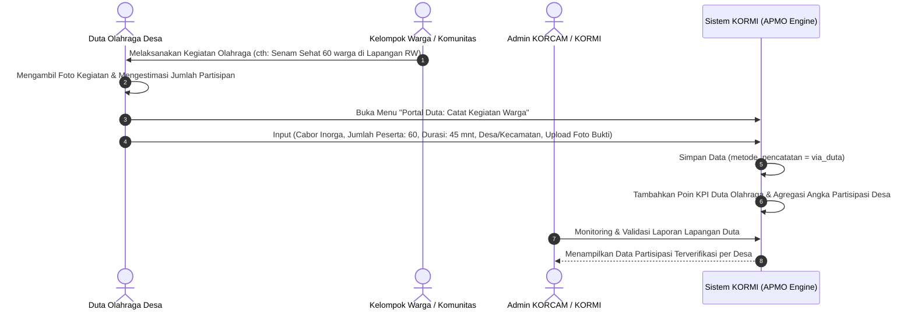

# Blueprint & Analisis Implementasi: Modul Pencatatan Partisipasi Olahraga Masyarakat (APMO) Terintegrasi Duta Olahraga

Dokumen ini merupakan cetak biru teknis (*technical blueprint*) komprehensif untuk **Modul Pencatatan Partisipasi Olahraga Masyarakat (APMO Tracker)** pada sistem KORMI Kabupaten Bandung, dengan dua skema input utama: **Pencatatan Mandiri oleh Warga** dan **Pencatatan Terfasilitasi oleh Duta Olahraga Desa/Kecamatan**.

---

## 1. Konsep Ganda: Pencatatan Mandiri vs Pencatatan via Duta Olahraga

Dalam realitas di lapangan, tidak semua warga (seperti lansia di senam tera, anak-anak pemain olahraga tradisional, atau masyarakat pedesaan) memiliki smartphone atau akun digital sendiri. Oleh karena itu, sistem dirancang dengan **Dua Saluran Pencatatan (Dual-Channel Logging)**:

```
                                  ┌─────────────────────────────────────────────────────────┐
                                  │      SALURAN PENCATATAN PARTISIPASI OLAHRAGA KORMI      │
                                  └────────────────────────────┬────────────────────────────┘
                                                               │
                       ┌───────────────────────────────────────┴───────────────────────────────────────┐
                       ▼                                                                               ▼
     ┌───────────────────────────────────┐                                           ┌───────────────────────────────────┐
     │   CHANNEL 1: PENCATATAN MANDIRI   │                                           │  CHANNEL 2: VIA DUTA OLAHRAGA     │
     │      (Warga / Pegiat Olahraga)    │                                           │     (Fasilitator Desa/Kecamatan)  │
     ├───────────────────────────────────┤                                           ├───────────────────────────────────┤
     │ • Login akun pribadi              │                                           │ • Login akun Duta Olahraga        │
     │ • Catat aktivitas perorangan      │                                           │ • Catat kegiatan Komunal/Massal   │
     │ • Upload foto selfie kegiatan     │                                           │   (Senam RW, Senam Tera, Lomba)   │
     │ • Pantau streak & badge pribadi   │                                           │ • Catat warga binaan tanpa HP     │
     │                                   │                                           │ • Upload foto kerumunan/absensi   │
     └─────────────────┬─────────────────┘                                           └─────────────────┬─────────────────┘
                       │                                                                               │
                       └───────────────────────────────┬───────────────────────────────────────────────┘
                                                       ▼
                                     ┌───────────────────────────────────┐
                                     │     ENGINE KALKULASI APMO KORMI   │
                                     │  (Agregasi Wilayah & Real-time)   │
                                     └───────────────────────────────────┘
```

---

## 2. Matriks Peran & Hak Akses Lengkap

| Peran (Role) | Slug Role | Tipe Akun | Hak & Wewenang Pencatatan |
| :--- | :--- | :--- | :--- |
| **Masyarakat / Pegiat** | `pegiat-olahraga` | Mandiri (Perorangan) | - Input log olahraga sendiri (1 orang/sesi)<br>- Melihat timeline dan pencapaian badge pribadi |
| **Duta Olahraga** | `duta-olahraga` | Fasilitator / Field Agent | - Input log olahraga mandiri untuk diri sendiri<br>- **Input log kegiatan Komunal/Massal** (misal: Senam 100 orang)<br>- **Input log atas nama Warga Binaan** (warga tanpa akun)<br>- Dashboard KPI Duta (total warga yang berhasil digerakkan) |
| **Admin KORCAM** | `admin-korcam` | Verifikator Kecamatan | - Approval akun masyarakat & monitoring Duta di wilayahnya<br>- Rekapitulasi capaian APMO 1 kecamatan |
| **Admin INORGA** | `admin-inorga` | Pembina Cabor | - Verifikasi & monitoring keaktifan cabor inorga terkait |
| **Super Admin** | `super-admin` | Pengelola Kabupaten | - Full CRUD, analitik global 31 kecamatan, penetapan target APMO |

---

## 3. Desain Skema Database & Relasi Model

### A. Penyesuaian Tabel `pengguna`
Menambahkan kolom pengait untuk mendeteksi apakah user adalah Duta Olahraga terdaftar:
```php
Schema::table('pengguna', function (Blueprint $table) {
    $table->foreignUuid('duta_id')->nullable()->constrained('kormi_duta_olahraga')->nullOnDelete()->after('peran_id');
});
```

### B. Tabel Utama: `kormi_partisipasi_aktivitas`
Tabel ini mampu menampung entri **Mandiri** maupun entri **Massal/Terfasilitasi Duta**:
```php
Schema::create('kormi_partisipasi_aktivitas', function (Blueprint $table) {
    $table->uuid('id')->primary();
    
    // User yang menginput data
    $table->foreignUuid('pengguna_id')->constrained('pengguna')->onDelete('cascade');
    
    // Siapa yang mencatat? (Mandiri vs Duta Olahraga)
    $table->enum('metode_pencatatan', ['mandiri', 'via_duta'])->default('mandiri');
    $table->foreignUuid('duta_id')->nullable()->constrained('kormi_duta_olahraga')->nullOnDelete();
    
    // Cabor & Wilayah Pelaksanaan
    $table->foreignUuid('inorga_id')->nullable()->constrained('kormi_inorga')->nullOnDelete();
    $table->foreignUuid('kecamatan_id')->constrained('master_kecamatan')->cascadeOnDelete();
    $table->foreignUuid('desa_kelurahan_id')->nullable()->constrained('master_desa_kelurahan')->nullOnDelete();
    
    // Detail Sesi Olahraga
    $table->string('nama_aktivitas'); // Contoh: "Senam Jabar Juara", "Jalan Sehat RW 05", "Latihan Egrang"
    $table->date('tanggal_aktivitas');
    $table->time('waktu_mulai')->nullable();
    $table->integer('durasi_menit'); // misal: 30, 45, 60 menit
    
    // Skema Partisipasi (Individu vs Massal)
    $table->enum('jenis_partisipasi', ['individu', 'kelompok_kecil', 'massal_komunitas'])->default('individu');
    $table->integer('jumlah_peserta')->default(1); // 1 jika individu, 50-500 jika senam massal oleh Duta
    $table->text('daftar_nama_peserta')->nullable(); // JSON / string daftar nama peserta jika tercatat
    
    // Lokasi & Venue
    $table->enum('kategori_lokasi', ['sapras_kormi', 'lapangan_desa', 'taman', 'jalan_desa', 'sekolah', 'rumah', 'lainnya'])->default('lapangan_desa');
    $table->foreignUuid('sapras_id')->nullable()->constrained('kormi_sapras')->nullOnDelete();
    $table->string('nama_tempat'); // misal: "Alun-alun Ciwidey", "Lapangan Voli RW 03"
    $table->decimal('latitude', 10, 8)->nullable();
    $table->decimal('longitude', 11, 8)->nullable();
    
    // Bukti Dokumentasi (Wajib untuk Verifikasi)
    $table->string('foto_kegiatan'); // Foto selfie (jika mandiri) atau foto dokumentasi keramaian (jika via duta)
    $table->string('foto_daftar_hadir')->nullable(); // Foto absensi fisik jika kegiatan massal duta
    $table->text('catatan')->nullable();
    
    // Status Validasi
    $table->enum('status_verifikasi', ['valid', 'pending_review', 'ditolak'])->default('valid');
    $table->foreignUuid('diverifikasi_oleh')->nullable()->constrained('pengguna')->nullOnDelete();
    
    $table->timestamps();
    $table->softDeletes();
    
    // Indexing
    $table->index(['tanggal_aktivitas', 'kecamatan_id']);
    $table->index(['duta_id', 'tanggal_aktivitas']);
    $table->index(['metode_pencatatan', 'tanggal_aktivitas']);
});
```

---

## 4. Alur Kerja Khusus Pencatatan via Duta Olahraga



---

## 5. Fitur-Fitur Baru Khusus Duta Olahraga

### A. Fitur Frontend Duta: "Portal Input Lapangan" (`PartisipasiDutaInput.php`)
1. **Mode Input Cepat (Quick Event Mode)**:
   - Tombol pilihan preset: *Senam Bersama*, *Jalan Sehat Warga*, *Festival Olahraga Tradisional*, *Gowes Desa*.
   - Slider / input cepat jumlah partisipan: `[ 10 ]` `[ 25 ]` `[ 50 ]` `[ 100 ]` `[ 200+ ]`.
2. **Kamera & Multiple Photo Upload**:
   - Foto Utama (Suasana Olahraga Bersama).
   - Foto Opsional (Lembar Absensi / Banner Spanduk Kegiatan).
3. **Penyimpanan Offline-first (Local Storage Fallback)**:
   - Jika sinyal di pelosok desa lemah, form tersimpan sementara di HP Duta dan di-sync otomatis saat terkoneksi internet.

### B. Fitur Frontend Duta: "Dashboard Kinerja Duta" (`DutaKinerja.php`)
1. **Total Warga yang Berhasil Digerakkan (Orang-Sesi)**: Akumulasi jumlah partisipan yang dilaporkan oleh Duta terkait.
2. **Frekuensi Pembinaan per Desa**: Grafik berapa kali kegiatan olahraga diadakan per bulan di desa binaannya.
3. **Peringkat Duta Teraktif Se-Kabupaten (Leaderboard Duta Olahraga)**: Apresiasi untuk memicu semangat penggerak olahraga di akar rumput.

### C. Fitur Backend: "Monitoring & Verifikasi Laporan Duta" (`PartisipasiDutaKelola.php`)
1. **Pemeriksaan Bukti Foto**: Admin Korcam dapat menginspeksi foto kegiatan dan jumlah peserta yang dilaporkan agar tidak terjadi manipulasi angka.
2. **Status Verifikasi 1-Klik**: Tombol `Approve` atau `Minta Koreksi Foto`.
3. **Laporan Honorarium / Evaluasi Duta**: Rekap bulanan keaktifan Duta Olahraga untuk dasar evaluasi insentif atau piagam penghargaan KORMI.

---

## 6. Algoritma Pembobotan APMO (Mandiri vs Massal Duta)

Agar data agregasi akurat dan proporsional:
1. **Sesi Mandiri**: Terhitung sebagai **1 data unik** dengan identitas NIK/User terverifikasi.
2. **Sesi Massal via Duta**:
   - Jika disertai absensi daftar nama $\rightarrow$ Terhitung sebagai data unik per NIK/Nama.
   - Jika berupa estimasi kerumunan massal (disertai foto validasi) $\rightarrow$ Dikonversi menjadi **Volume Partisipasi Masyarakat Wilayah** ($\text{Orang-Jam/Minggu}$).

$$\text{Volume Partisipasi Desa} = \sum (\text{Jumlah Peserta} \times \text{Durasi (Jam)})$$

---

## 7. Rencana Penambahan File & Komponen

```
app/
├── Models/
│   └── Kormi/
│       ├── PartisipasiAktivitas.php       # Model utama log partisipasi (Mandiri & Duta)
│       └── ApmoTargetWilayah.php          # Target tahunan per wilayah
│
├── Livewire/
│   ├── Frontend/
│   │   └── Kormi/
│   │       ├── Partisipasi/
│   │       │   ├── PartisipasiInput.php         # Form input warga mandiri
│   │       │   ├── PartisipasiRiwayat.php       # Riwayat & streak warga
│   │       │   └── PartisipasiDutaInput.php     # [BARU] Form mobile khusus Duta Olahraga
│   │       └── Duta/
│   │           └── DutaKinerjaDashboard.php     # [BARU] Portofolio & KPI Duta Olahraga
│   │
│   └── Backend/
│       └── Kormi/
│           └── Partisipasi/
│               ├── PartisipasiKelola.php        # Kelola semua log (filter Mandiri / Duta)
│               ├── PartisipasiStatistik.php     # Heatmap 31 kecamatan & statistik APMO
│               └── PartisipasiDutaMonitoring.php # [BARU] Panel evaluasi & audit laporan Duta
```

---

## 8. Roadmap Implementasi Teknis

1. **Tahap 1: Migration & Roles**
   - Migration update `pengguna` & tabel `kormi_partisipasi_aktivitas` (kolom `metode_pencatatan`, `duta_id`, `jenis_partisipasi`, `jumlah_peserta`, `foto_daftar_hadir`).
   - Role `duta-olahraga` & `pegiat-olahraga`.
2. **Tahap 2: Model & Logika Bisnis**
   - Relasi `PartisipasiAktivitas` dengan `DutaOlahraga`, `Pengguna`, `Inorga`, `Kecamatan`, `DesaKelurahan`.
3. **Tahap 3: Form Input Duta di Frontend**
   - Livewire component `PartisipasiDutaInput` dengan kamera capture, preset cabor, & tagging desa binaan.
4. **Tahap 4: Panel Backend & Verifikasi**
   - Filter tab di CMS: *Semua*, *Input Mandiri*, *Laporan Duta Olahraga*.
   - Dashboard analitik APMO real-time berbasis 31 kecamatan.
